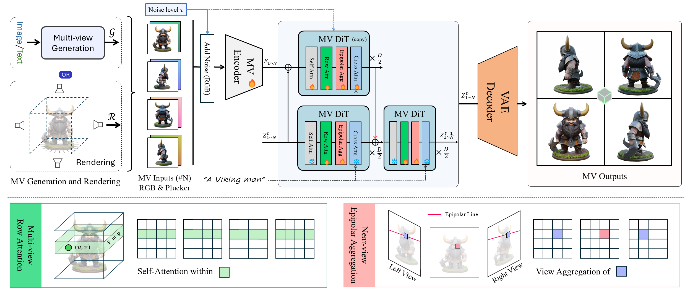

<div align="center">
    <h1>
    3DEnhancer: Consistent Multi-View Diffusion for 3D Enhancement
    </h1>
</div>

<div>
    <h4 align="center">
        <a href="https://yihangluo.com/projects/3DEnhancer" target='_blank'>
        
        </a>
        <a href="https://arxiv.org/abs/2412.18565" target='_blank'>
        
        </a>
        <a href="https://youtu.be/N7bfyd7B4D8" target='_blank'>
        
        </a>
        <a href="https://huggingface.co/spaces/yslan/3DEnhancer" target='_blank'>
            
        </a>
        
    </h4>
</div>

<div align="center">
    <p>
        <span style="font-variant: small-caps;"><strong>3DEnhancer</strong></span> employs a multi-view 
        diffusion model to enhance multi-view images, thus improving 3D models.
    </p>
    
    :open_book: For more visual results, go checkout our <a href="https://yihangluo.com/projects/3DEnhancer" target="_blank">project page</a>
</div>

<br>

<details>
<summary><b>Introducing 3DEnhancer</b></summary>
    <br>
    <div align="center">
        
        <p align="justify">
            Despite advances in neural rendering, due to the scarcity of high-quality 3D datasets 
            and the inherent limitations of multi-view diffusion models, view synthesis and 3D model 
            generation are restricted to low resolutions with suboptimal multi-view consistency. 
            In this study, we present a novel 3D enhancement pipeline, dubbed <span style="font-variant: small-caps;"><strong>3DEnhancer</strong></span>, which employs 
            a multi-view latent diffusion model to enhance coarse 3D inputs while preserving multi-view consistency. 
            Our method includes a <strong>pose-aware encoder</strong> and a <strong>diffusion-based denoiser</strong> to refine low-quality 
            multi-view images, along with <strong>data augmentation</strong> and a <strong>multi-view attention module with epipolar 
            aggregation</strong> to maintain consistent, high-quality 3D outputs across views. Unlike existing video-based 
            approaches, our model supports seamless multi-view enhancement with improved coherence across diverse 
            viewing angles. Extensive evaluations show that <span style="font-variant: small-caps;">3DEnhancer</span> significantly outperforms existing methods, 
            boosting both multi-view enhancement and per-instance 3D optimization tasks.
        </p>
    </div>
</details>


## :fire: News

- [2024/03/08] Our inference code and [Gradio demo](https://huggingface.co/spaces/yslan/3DEnhancer) are released.
- [2024/12/25] Our paper and project page are now live. Merry Christmas!


## 🔧 Installation

1. Clone Repo
    ```bash
    git clone --recurse-submodules https://github.com/Luo-Yihang/3DEnhancer
    cd 3DEnhancer
    ```

2. Create Conda Environment 
    ```bash
    conda create -n 3denhancer python=3.10 -y
    conda activate 3denhancer
    ```
3. Install Python Dependencies

    **Important:** Install [Torch](https://pytorch.org/get-started/locally/) and [Xformers](https://github.com/facebookresearch/xformers) based on your CUDA version. For example, for *Torch 2.1.0 + CUDA 11.8*:

    ```
    # Install Torch and Xformers
    pip install torch==2.1.0 torchvision==0.16.0 torchaudio==2.1.0 --index-url https://download.pytorch.org/whl/cu118
    pip install -U xformers --index-url https://download.pytorch.org/whl/cu118

    # Install other dependencies
    pip install -r requirements.txt
    ```

## :floppy_disk: Pretrained Weights

Download the pretrained model from [Hugging Face](https://huggingface.co/Luo-Yihang/3DEnhancer) and place it under `pretrained_models/3DEnhancer`:

```bash
mkdir -p pretrained_models/3DEnhancer
wget -P pretrained_models/3DEnhancer https://huggingface.co/Luo-Yihang/3DEnhancer/resolve/main/model.safetensors
```

## :computer: Inference
The code has been tested on *NVIDIA A100 and V100 GPUs*. An NVIDIA GPU with *at least 18GB of memory* is required.

We provide example inputs in `assets/examples/mv_lq`, where each subfolder contains four sequential multi-view images. Perform inference on multi-view images using an aligned `prompt` and `noise_level`. For example:

```bash
python inference.py \
    --input_folder assets/examples/mv_lq/vase \
    --output_folder results/vase \
    --prompt "vase" \
    --noise_level 0
```

For more options, refer to [`inference.py`](./inference.py).

## :zap: Demo
The script [`app.py`](app.py) provides a simple web demo for generating and enhancing multi-view images, as well as reconstructing 3D models using [LGM](https://github.com/3DTopia/LGM).

Install a *modified Gaussian splatting* (with depth and alpha rendering) required for LGM:
```bash
git clone --recursive https://github.com/ashawkey/diff-gaussian-rasterization
pip install ./diff-gaussian-rasterization
```

Download the LGM pretrained weights from [Hugging Face](https://huggingface.co/ashawkey/LGM) and place it under `pretrained_models/LGM`:
```bash
mkdir -p pretrained_models/LGM
wget -P pretrained_models/LGM https://huggingface.co/ashawkey/LGM/resolve/main/model_fp16_fixrot.safetensors
```

After installing the dependencies, start the demo with:

```sh
python app.py
```

***The web demo is also available on [Hugging Face Spaces](https://huggingface.co/spaces/yslan/3DEnhancer)! 🎉***

## :calendar: TODO

- [x] Release paper and project page.
- [x] Release inference code.
- [x] Release Gradio demo.

## :page_with_curl: License

This project is licensed under <a rel="license" href="./LICENSE">NTU S-Lab License 1.0</a>. Redistribution and use should follow this license.

## :pencil: Citation

If you find our code or paper helps, please consider citing:

```bibtex
@article{luo20243denhancer,
    title={3DEnhancer: Consistent Multi-View Diffusion for 3D Enhancement}, 
    author={Yihang Luo and Shangchen Zhou and Yushi Lan and Xingang Pan and Chen Change Loy},
    booktitle={arXiv preprint arXiv:2412.18565}
    year={2024},
}
```

## :mailbox: Contact
If you have any questions, please feel free to reach us at `luo_yihang@outlook.com`. 